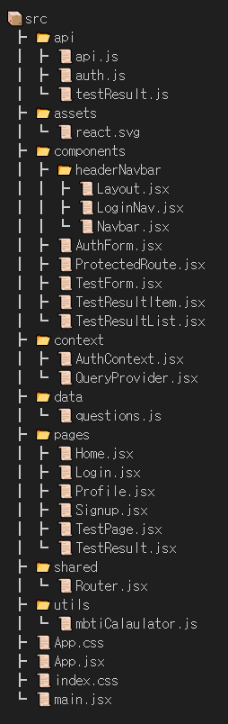

# **MBTI 체크리스트 웹 사이트**
  

## 📖 목차

1. [프로젝트 소개](#프로젝트-소개)
2. [주요기능](#주요기능)
3. [개발기간](#개발기간)
4. [기술스택](#기술스택)
5. [디랙토리](#디랙토리)

  

## 👨‍🏫 프로젝트 소개

이거 모르면 대화가 안된다!!   
상황별 재밌는 질문으로 나의 MBTI를 찾아볼 수 있는 간단 <strong>MBTI 체크리스트 사이트</strong>입니다. 

  

## 🚑 주요기능

1. **회원 관리**

   - 사용자 로그인 및 회원가입 기능 제공

2. **MBTI 테스트**

   - 20개의 문항으로 mbti 검사
   
  

3. **프로필**
   - 개인 프로필에서 닉네임 수정 가능

4. **결과**
   - 다른 유저의 결과 공유 가능
   - 본인의 결과도 공유 가능
   - 본인의 결과 공개, 비공개 가능
  비공개 설정 시 다른 유저는 나의 결과를 볼 수 없습니다.
   - 본인의 결과 삭제 가능

  

## ⏲️ 개발기간

- 2024.11.22 ~ 2024.11.28

  
 
## 📚️ 기술스택

  
	
	
	
	

  

## 🌏 디랙토리

